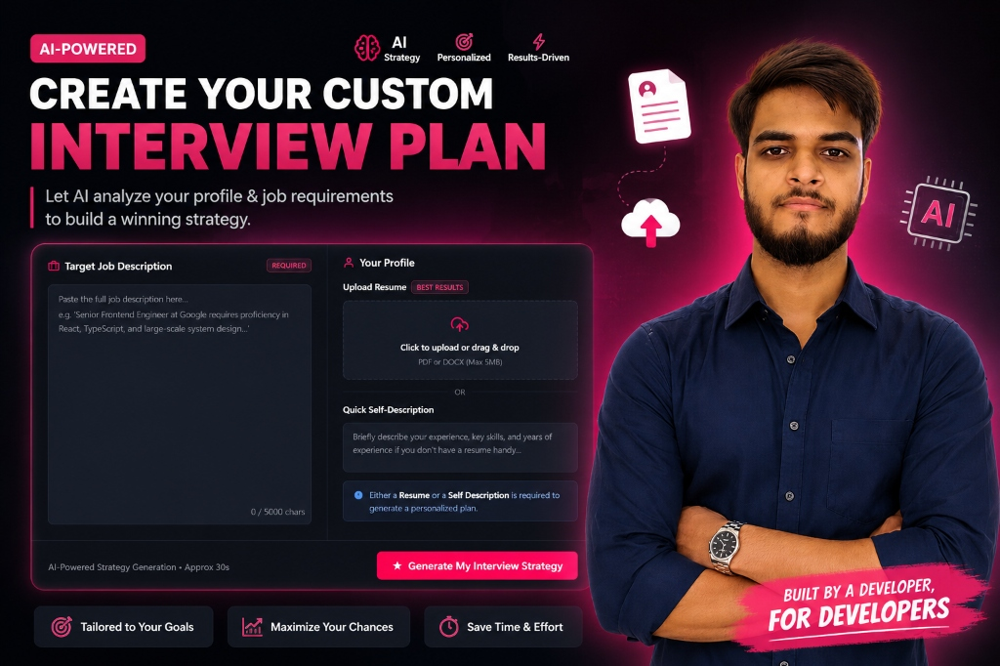

# InterviewAI - AI-Powered Interview Preparation Platform



**InterviewAI** is a high-intensity, premium AI-powered platform designed to build a winning strategy for candidates preparing for top MNC (e.g., FAANG/MAMAA) interviews. By analyzing a candidate's resume (PDF/DOCX) or self-description alongside the target job description, the application generates a comprehensive, personalized **Interview Blueprint** containing tailored technical and behavioral questions, day-by-day roadmaps, algorithmic pattern checklists, skill gap analysis, and even a custom, single-page ATS-optimized PDF resume.

---

## 🚀 Key Features

*   **Circular Candidate Match Score:** Get an instant visual percentage of how well your experience aligns with the target job requirements.
*   **Technical & Behavioral Blueprint:**
    *   **8 Specialized Technical Questions:** Curated questions targeting your profile and the job description, complete with the interviewer's hidden intent and perfect model answers.
    *   **8 STAR-Method Behavioral Questions:** STAR-method questions tailored to your experience to help you formulate strong narrative responses.
*   **14-Day Strategy Roadmap:** A comprehensive, day-by-day study calendar outlining core focus areas and actionable tasks to ensure you are fully prepared.
*   **Strategic Gap & Vulnerability Analysis:** Compares your resume directly with the target job description to find missing qualifications, prioritizing them from Low to High priority and providing concrete pivot strategies.
*   **DSA Pattern Roadmap:** Outlines 8-10 major computer science and algorithmic patterns (BFS/DFS, Two Pointers, Trees, Heaps, Sliding Window, DP, etc.) and lists specific MNC-targeted LeetCode problems, conceptual strategies, and direct links to solve them.
*   **ATS-Friendly Resume Compiler:** Formulates a beautiful, professional, 1-page ATS-optimized resume in HTML/CSS and compiles it into an A4 PDF via Puppeteer for direct download.
*   **Expert Playbook:** High-stakes interview strategy and performance-boosting tips to stand out to hiring managers.
*   **Saved Reports History:** Access and review your generated blueprints, search previous reports, and clean up completed roadmaps.

---

## 🛠️ Tech Stack

### Frontend
*   **Core:** React.js (Vite)
*   **Routing:** React Router (v7)
*   **Styling:** Sass / SCSS (Custom premium dark glassmorphism UI with vibrant teal and gold accents)
*   **Networking:** Axios

### Backend
*   **Runtime:** Node.js
*   **Framework:** Express.js
*   **Database:** MongoDB with Mongoose ODM
*   **Authentication:** JWT (JSON Web Tokens) & Bcrypt (Password hashing)
*   **PDF Compiler:** Puppeteer (Headless chrome automation)
*   **AI Integration:** Groq SDK (utilizing `llama-3.3-70b-versatile` for ultra-fast generation) and Google GenAI API

---

## 📂 Project Structure

```text
GEN-AI/
├── Backend/
│   ├── bin/                 # Entry point scripts
│   ├── controllers/         # Express controllers (auth, interview)
│   ├── db/                  # MongoDB connection config
│   ├── middlewares/         # Auth verify, file upload helpers
│   ├── models/              # Mongoose schemas (user, interview report)
│   ├── routes/              # Express routes (auth.routes.js, interview.routes.js)
│   ├── services/            # AI services & Puppeteer PDF generation
│   ├── app.js               # Express application configuration
│   ├── server.js            # Port binding and startup script
│   └── package.json         # Backend dependencies & npm scripts
├── Frontend/
│   ├── public/              # Static assets
│   ├── src/
│   │   ├── assets/          # Project assets
│   │   ├── features/        # Feature modules
│   │   │   ├── auth/        # Login, Register, Protected Route views
│   │   │   ├── interview/   # Home dashboard, Blueprint pages, hooks
│   │   │   └── style/       # SCSS stylesheets (layout, design tokens)
│   │   ├── App.jsx          # Main App entry point
│   │   ├── app.routes.jsx   # Router definition
│   │   ├── main.jsx         # DOM binding
│   │   └── style.scss       # Global CSS & SCSS overrides
│   └── package.json         # Frontend dependencies & scripts
├── docs/                    # Additional documentation and assets
├── thumbnail.png            # Premium banner image
└── README.md                # Project documentation
```

---

## ⚙️ Getting Started & Installation

### Prerequisites
*   [Node.js](https://nodejs.org/) (v18+ recommended)
*   [MongoDB](https://www.mongodb.com/) (Local instance or Atlas Cloud database)
*   A [Groq Console](https://console.groq.com/) API Key or [Google Gemini API Key](https://aistudio.google.com/)

---

### Step 1: Clone and Install Dependencies

```bash
# Clone the repository
git clone https://github.com/Adshkumar/ai-interview-platform-.git
cd ai-interview-platform-

# Install Backend dependencies
cd Backend
npm install

# Install Frontend dependencies
cd ../Frontend
npm install
```

---

### Step 2: Configure Environment Variables

Create a `.env` file in the **Backend** directory and define the following variables:

```env
PORT=4000
MONGO_URI=your_mongodb_connection_string
JWT_SECRET=your_jwt_signing_key
GROQ_API_KEY=your_groq_api_key
```

Create a `.env` file in the **Frontend** directory to point to your backend API:

```env
PORT=4000
VITE_API_URL=http://localhost:4000
```

---

### Step 3: Run the Application

#### Start the Backend Server:
```bash
cd Backend
# Run in development mode (with nodemon)
npm run dev
```

#### Start the Frontend Server:
```bash
cd Frontend
# Run React + Vite in development mode
npm run dev
```

The application will start, and you can open `http://localhost:5173` (or the port specified by Vite) in your browser.

---

## 🔌 API Endpoints Reference

### Authentication Routes
*   `POST /api/auth/register` - Create a new user account.
*   `POST /api/auth/login` - Authenticate a user and receive a JWT token.
*   `GET /api/auth/me` - Retrieve current user profile (requires Auth).

### Interview Prep Blueprint Routes
*   `POST /api/interview/` - Generate a new blueprint report. Accepts `selfDescription`, `jobDescription` strings, and a `resume` file upload (PDF/DOCX).
*   `GET /api/interview/` - Retrieve all interview blueprints generated by the logged-in user.
*   `GET /api/interview/report/:interviewId` - Fetch the detailed sections of a specific blueprint report.
*   `POST /api/interview/delete-report/:interviewId` - Delete a generated report by ID.
*   `POST /api/interview/resume/pdf/:interviewReportId` - Compile and stream an ATS-optimized, 1-page resume PDF for download.

---

## 💡 AI Engineering Details

1.  **Strict Output Schemas:** The backend enforces structure through **Zod Schema validation**. When invoking the Llama-3.3-70b model via the Groq SDK, the prompt dictates exact JSON formatting and structural limitations to ensure structural integrity.
2.  **Fallback Safe-Guards:** If the AI model returns invalid JSON, the service is engineered with regex cleanup tools and built-in professional defaults to guarantee that the UI never breaks.
3.  **PDF Generation Architecture:** Puppeteer launches a headless browser, renders a styled resume HTML template loaded with the AI-optimized candidate profile data, and executes an A4 PDF output print stream.

---

## 📄 License
This project is licensed under the MIT License. See the LICENSE file for details.

---

*Made with 💻 and 🧠 by [Adarsh Kumar](https://adsingh-portfolio.vercel.app/home)*
